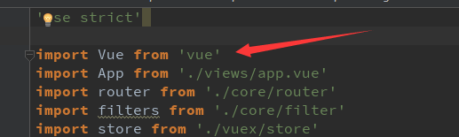
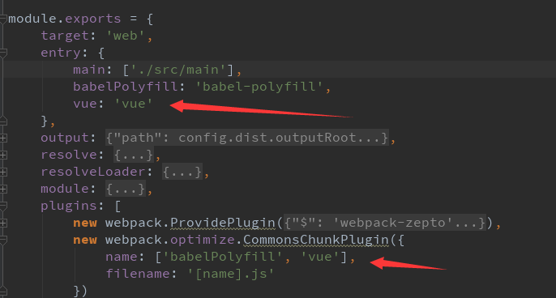
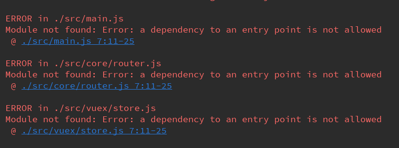
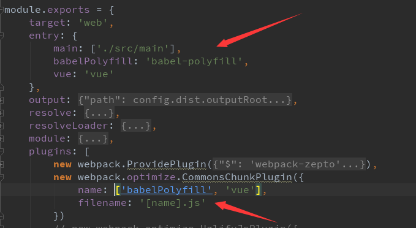

# 代码拆分
## 如果入口文件中有该文件的引入，又把该文件在入口配置中单独设置，配合CommonsChunkPlugin希望单独分离出该文件，会报依赖错误。
* main.js

* 想要分离出库vue

## 没有引用的库可以被分离

## 参考文档
* [webpack - code-splitting](https://doc.webpack-china.org/guides/code-splitting/)
* [webpack - commons-chunk-plugin](https://doc.webpack-china.org/plugins/commons-chunk-plugin)